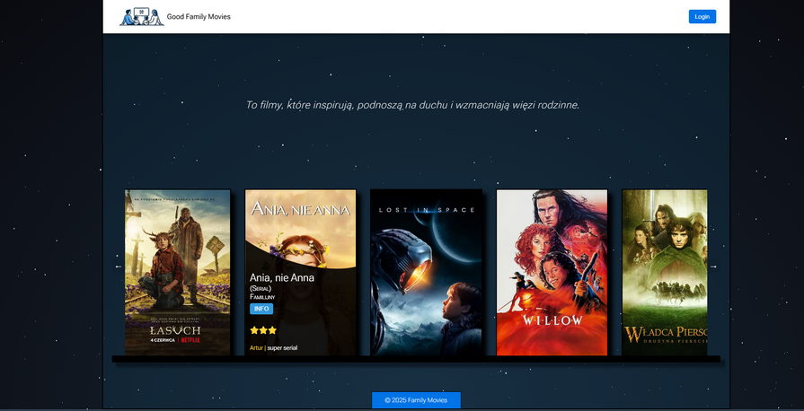
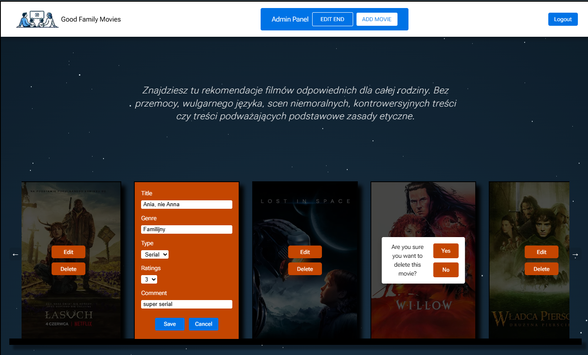
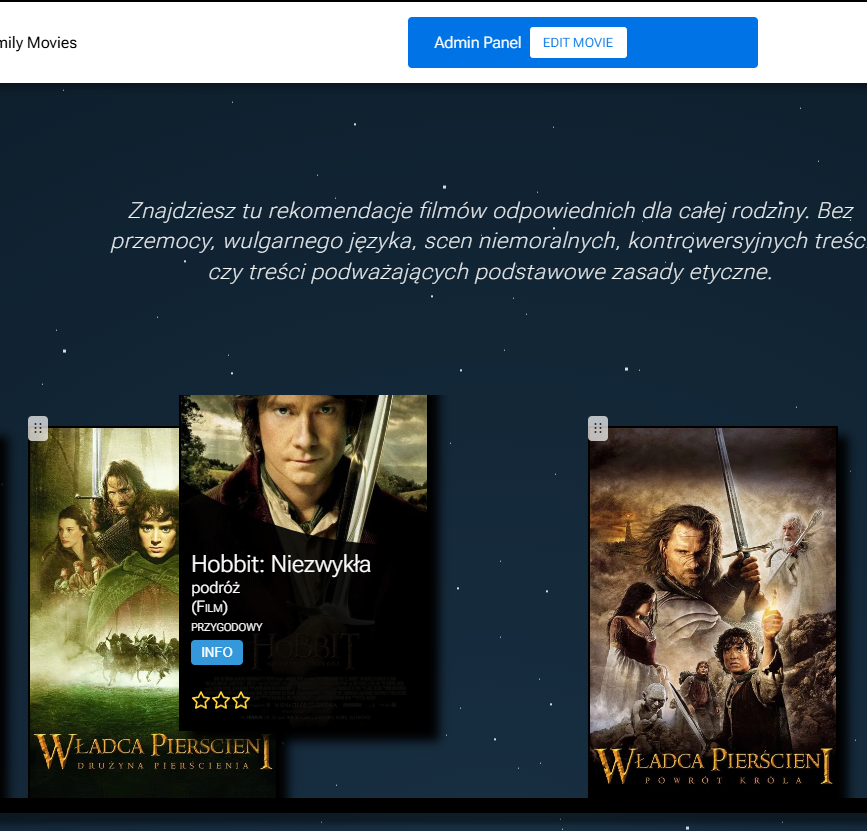
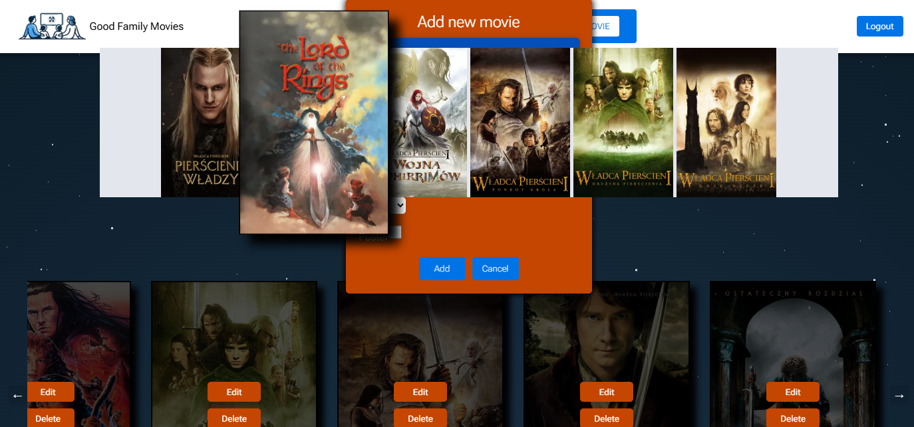

<p align="center"> Front page </p>



<p align="center"> Admin Edit Mode: </p>



<p align="center"> Drag&Drop functionality: </p>



<p align="center"> Add new movie and finding/select poster: </p>



# Good Family Movies

See the live version of [Good Family Movies](https://our-family-films.vercel.app/).

The site was created for parents looking for valuable movies that are safe to watch with their children and teens.

Here you will find recommendations of films that are suitable for all the family. We want to avoid films with stupid violence, bad language, scenes that are too sexual, films that are controversial, or films that do not follow basic moral rules.

These are films that we watched with our teenage children. The movies clearly show what is good and what is evil, and they promote Christian values like family, friendship, love, hope, helping those in need, sacrifice, and respect for others.

## 🎬 Integration with TMDB

The project uses the API of The Movie Database (TMDB), one of the largest movie databases in the world. With this integration:

Access to up-to-date movie information (descriptions, ratings, cast)
High-quality movie posters
Movie metadata (year of production, director, genre)
Regular content updates without the need for manual data entry
Integration with TMDB allows you to focus on curating movies suitable for families, while the technical aspects of movie data are handled by a professional database.

**Main features**:

- Movie browsing - intuitive interface to discover new titles
- Detailed information - each movie includes description, rating and review
- Admin panel - ability to add and remove movies (admins only)
- Edit reviews - logged-in users can edit movie reviews
- Drag & Drop - the ability to move movies on a virtual shelf to adjust their order according to your preferences
- Animated transitions - smooth animations when viewing movie details
- Responsive design (only 1 @media) - tailored for mobile and desktop devices.
- PARALLAX PIXEL STARS background (only CSS)

&nbsp;

## 💡 Technologies


## Libraries and tools: &nbsp;

- TMDB API - integration with The Movie Database for retrieving up-to-date movie data
- React Context API - managing global application state
- CSS Modules - component styling with class name isolation
- React Hooks - managing state and effects in function components
- CSS Animations - smooth transitions between views
- React DnD - implementation of drag & drop functionality for interactive video collection management
- UUID v4 - generation of unique identifiers for videos
- Jest/React Testing Library - comprehensive testing of components and functionality

&nbsp;

## 💿 Installation

The project uses [node](https://nodejs.org/en/) and [npm](https://www.npmjs.com/). Having them installed, type into the terminal: `npm i` and `npm run dev`.

`http://localhost:3000`

&nbsp;

## 🤔 Solutions provided in the project

- Interactive movie shelf - ability to reorganize movies using drag and drop mechanism
- Saving changes in the order of videos between sessions

## ✨ Animated background with stars (only CSS !)

The application uses a dynamic animated background with a starry sky effect, which adds a unique character and atmosphere when viewing videos:

- Implementation using react-tsparticles library - an advanced tool for creating interactive particle animations
- Configurable animation parameters (number of stars, speed, interactivity)
- Performance optimization through the use of WebGL and Canvas
- Responsiveness - the animation adapts to different screen sizes
- Subtle parallax effect reacting to cursor movement

The animated background not only improves the aesthetics of the application, but also alludes to the magical world of cinema, creating an immersive experience for users browsing movie recommendations.

```
some example code

more code :)
```

&nbsp;

- five - example with a screenshot
  

&nbsp;

## 💭 Conclusions for future projects

- Multilingual version (Polish/English)

&nbsp;

## 🙋‍♂️ Feel free to contact me

Write sth nice ;)

&nbsp;

## 👏 Thanks

Thanks to God for providing me with this task.

[Lixia](https://github.com/lxland/pixelStar) for PARALLAX PIXEL STARS background
